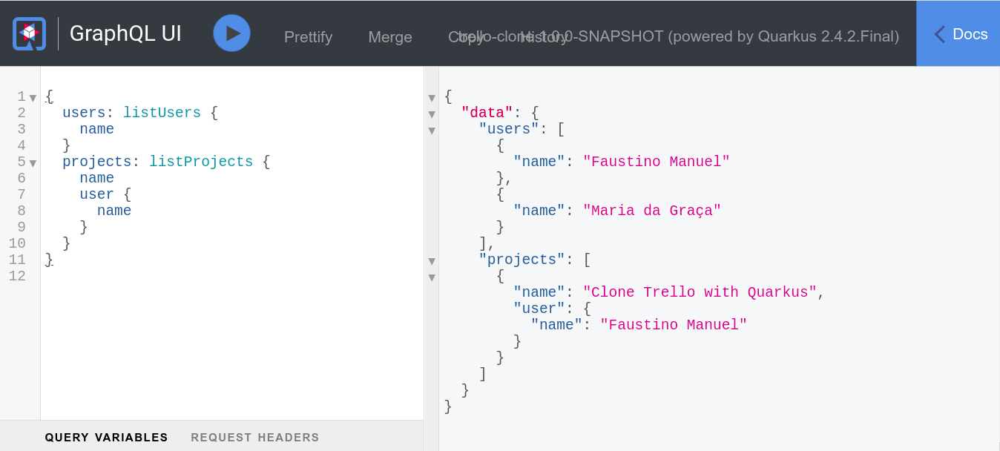

# trello-kotlin-clone

This project uses **[Quarkus](https://quarkus.io/)**, the Supersonic Subatomic Java Framework.

## About

trello-kotlin-clone is **GraphQL Api** develop with Quarkus using **kotlin and GraphQL MicroProfile**

## Objective

this project was developed in order to improve and learn about **CQRS** and **GraphQL API** with **Quarkus** using the **[Kotlin](https://kotlinlang.org/docs/getting-started.html)** a language that runs on JVM(Java Virtual Machine)

## Running the application

You can run your application in dev mode that enables live coding using the following steps:

## 1ª

```shell script
git clone https://github.com/fmanuel98/trello-kotlin-clone.git

```

## 2º

```shell script
cd trello-kotlin-clone

```

## 3º

```shell script
docker-compose up -d && ./mvnw compile quarkus:dev
```

4º Open you browser an write url balow

> **_NOTE:_** Quarkus now ships with a Dev UI, which is available in dev mode only at http://localhost:8080/q/dev/.

> **GraphQL Play Ground** http://localhost:8080/q/graphql-ui/

> **GraphQL Schema** http://localhost:8080/graphql/schema.graphql

## Finally


